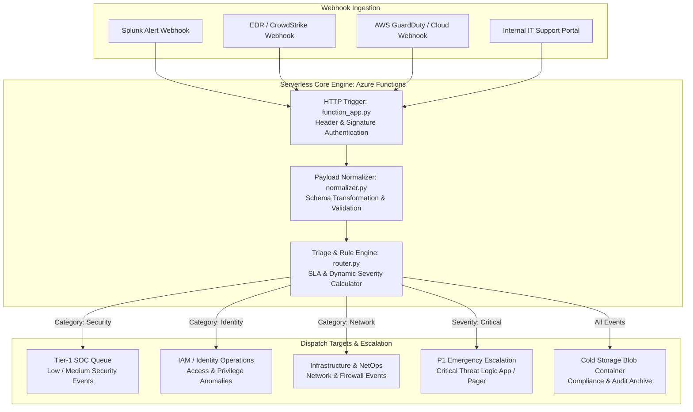

# Serverless Security Alert & Ticket Routing Engine

## Overview
A high-throughput, event-driven serverless routing engine built on **Azure Functions (Python v2 Model)**. The engine ingests multi-vendor security alert webhooks (SIEM, EDR, CloudWatch, Identity Systems), normalizes disparate JSON payloads into a standardized schema, calculates dynamic triage severity scores, and dispatches enriched tickets to designated SOC queues and emergency response channels.



---

## Key Capabilities

* **Multi-Vendor Payload Normalization:** Ingests disparate alert structures and standardizes critical fields (timestamp, source IP, user principal, affected asset, raw log) into a unified incident schema.
* **Dynamic Severity & SLA Heuristics:** Evaluates multi-factor weights (user privilege level, critical asset tag, attack signature keywords) to calculate real-time priority scores (`LOW`, `MEDIUM`, `HIGH`, `CRITICAL`).
* **Dead-Letter Handling & Fault Tolerance:** Includes structured validation and exception trapping to quarantine malformed payloads without dropping downstream events.
* **Serverless Cost Optimization:** Designed to scale to zero during idle periods and instantly scale out during high-volume security incidents.
* **Automated Test Coverage:** Includes a comprehensive `pytest` test suite with mock HTTP requests testing routing logic, boundary thresholds, and schema validation.

---

## Architecture & Tech Stack

* **Compute Platform:** Azure Functions (Serverless Python v2 Programming Model)
* **Runtime:** Python 3.9+ / 3.10+
* **Validation & Data Layer:** Pydantic / Python Dataclasses, JSON Schema
* **Integration Layer:** Azure Logic Apps, Webhooks, REST APIs, Azure Blob Storage
* **Testing Framework:** PyTest with `unittest.mock`

---

## Directory Structure

```text
|-- README.md                         # Comprehensive architecture documentation
|-- LICENSE                           # MIT License
|-- host.json                         # Azure Functions host configuration
|-- local.settings.json               # Local environment variables & secrets
|-- requirements.txt                  # Python dependencies
|-- function_app.py                   # Main Azure Function HTTP Trigger entry point
|-- src/
|   |-- __init__.py
|   |-- models.py                     # Pydantic data schemas & normalized models
|   |-- normalizer.py                 # Multi-vendor payload transformation logic
|   |-- router.py                     # Category & priority routing rule engine
|   `-- dispatchers.py                # Queue & webhook dispatch connectors
|-- tests/
|   |-- __init__.py
|   |-- test_router.py                # Unit tests for routing rules
|   `-- test_normalizer.py            # Unit tests for payload normalization
`-- samples/
    |-- sample_splunk_alert.json      # Sample raw Splunk webhook payload
    |-- sample_edr_alert.json         # Sample raw EDR alert payload
    `-- sample_output_ticket.json     # Standardized enriched output artifact
```

---

## Core Routing Engine (`function_app.py` & `src/router.py`)

### Main Azure Function Trigger (`function_app.py`)
```python
import azure.functions as func
import logging
import json
from src.normalizer import normalize_payload
from src.router import evaluate_and_route

app = func.FunctionApp(http_auth_level=func.AuthLevel.FUNCTION)

@app.route(route="v1/route-ticket", methods=["POST"])
def route_security_ticket(req: func.HttpRequest) -> func.HttpResponse:
    logging.info("Processing inbound security alert webhook...")

    try:
        req_body = req.get_json()
    except ValueError:
        return func.HttpResponse(
            json.dumps({"status": "error", "message": "Invalid JSON body"}),
            status_code=400,
            mimetype="application/json"
        )

    # 1. Normalize Payload across vendors
    normalized_alert = normalize_payload(req_body)

    # 2. Evaluate Severity and Target Queue
    routing_result = evaluate_and_route(normalized_alert)

    return func.HttpResponse(
        json.dumps(routing_result, indent=2),
        status_code=200,
        mimetype="application/json"
    )
```

---

### Dynamic Routing Logic (`src/router.py`)
```python
def calculate_severity(alert: dict) -> str:
    """Calculates dynamic severity based on asset value and threat indicators."""
    score = 0
    raw_text = json.dumps(alert).lower()

    # Threat indicator heuristics
    if any(k in raw_text for k in ["brute_force", "unauthorized", "mimikatz", "ransomware"]):
        score += 40
    if alert.get("is_privileged_user", False):
        score += 30
    if alert.get("asset_criticality") == "TIER_0":
        score += 30

    if score >= 70:
        return "CRITICAL"
    elif score >= 40:
        return "HIGH"
    elif score >= 20:
        return "MEDIUM"
    return "LOW"

def evaluate_and_route(alert: dict) -> dict:
    severity = calculate_severity(alert)
    category = alert.get("category", "SECURITY").upper()

    # Routing determination
    if severity == "CRITICAL":
        target_queue = "P1_EMERGENCY_ESCALATION"
    elif category == "IDENTITY" or "iam" in alert.get("source", "").lower():
        target_queue = "IAM_OPERATIONS_QUEUE"
    elif category == "NETWORK" or "firewall" in alert.get("source", "").lower():
        target_queue = "NETOPS_TRIAGE_QUEUE"
    else:
        target_queue = "SOC_TIER1_QUEUE"

    return {
        "status": "PROCESSED",
        "ticket_id": alert.get("alert_id", "TICK-UNKNOWN"),
        "calculated_severity": severity,
        "assigned_queue": target_queue,
        "normalized_payload": alert
    }
```

---

## Sample Execution & Output Payload

### Inbound Raw Webhook (`samples/sample_splunk_alert.json`)
```json
{
  "search_name": "Active Brute Force Detected",
  "result": {
    "src_ip": "203.0.113.5",
    "user": "admin",
    "failed_attempts": 14,
    "host": "DC-PRIMARY-01"
  }
}
```

### Enriched Standardized Output (`samples/sample_output_ticket.json`)
```json
{
  "status": "PROCESSED",
  "ticket_id": "TICK-2026-0825-9921",
  "calculated_severity": "CRITICAL",
  "assigned_queue": "P1_EMERGENCY_ESCALATION",
  "normalized_payload": {
    "alert_source": "SPLUNK_SIEM",
    "event_type": "AUTHENTICATION_ANOMALY",
    "target_user": "admin",
    "source_ip": "203.0.113.5",
    "asset_criticality": "TIER_0",
    "is_privileged_user": true,
    "timestamp": "2026-08-25T17:45:00Z"
  }
}
```

---

## Getting Started & Local Testing

### 1. Prerequisites
* Python 3.9+
* **Azure Functions Core Tools v4** (`npm install -g azure-functions-core-tools@4 --unsafe-perm true`)
* **Azurite** storage emulator (optional for local storage queues)

### 2. Installation & Local Execution
```bash
# Clone the repository
git clone https://github.com/elazarf123/serverless-ticket-router.git
cd serverless-ticket-router

# Create virtual environment and install dependencies
python -m venv .venv
source .venv/bin/activate  # On Windows: .venv\Scripts\Activate.ps1
pip install -r requirements.txt

# Start the serverless function locally
func start
```

### 3. Run Test Suite
```bash
# Run unit tests with pytest
pytest tests/ -v
```

